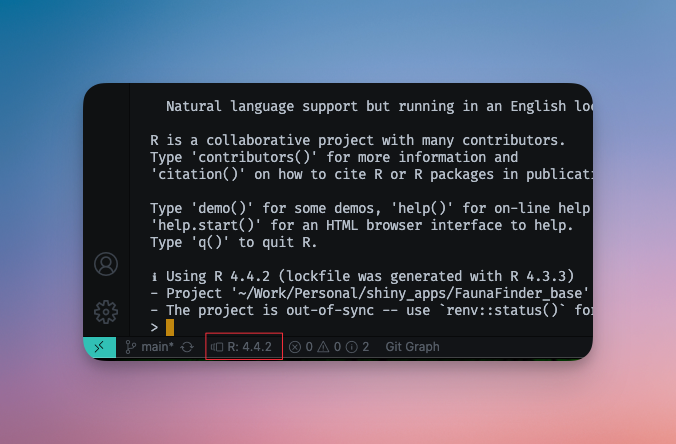
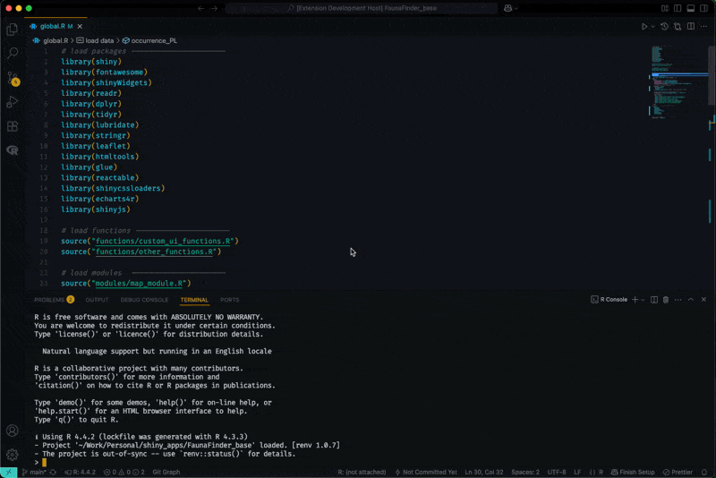
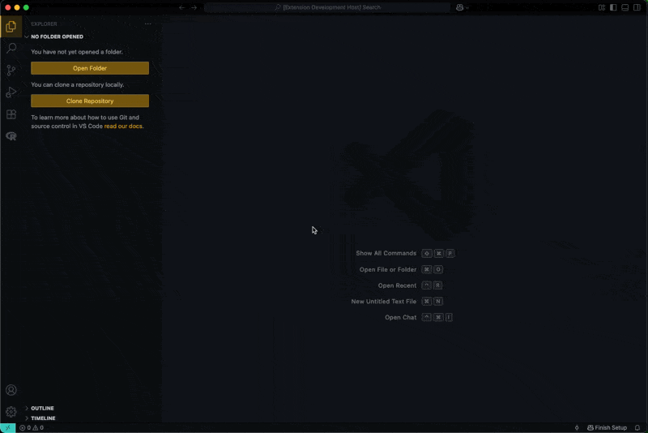
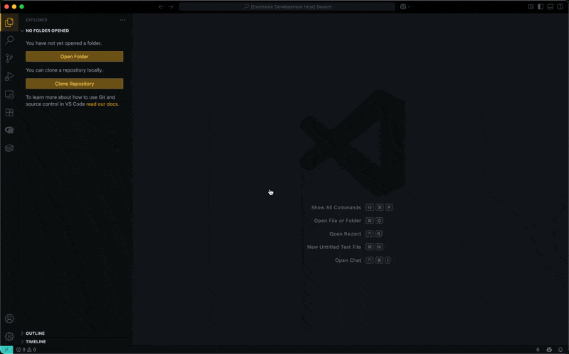
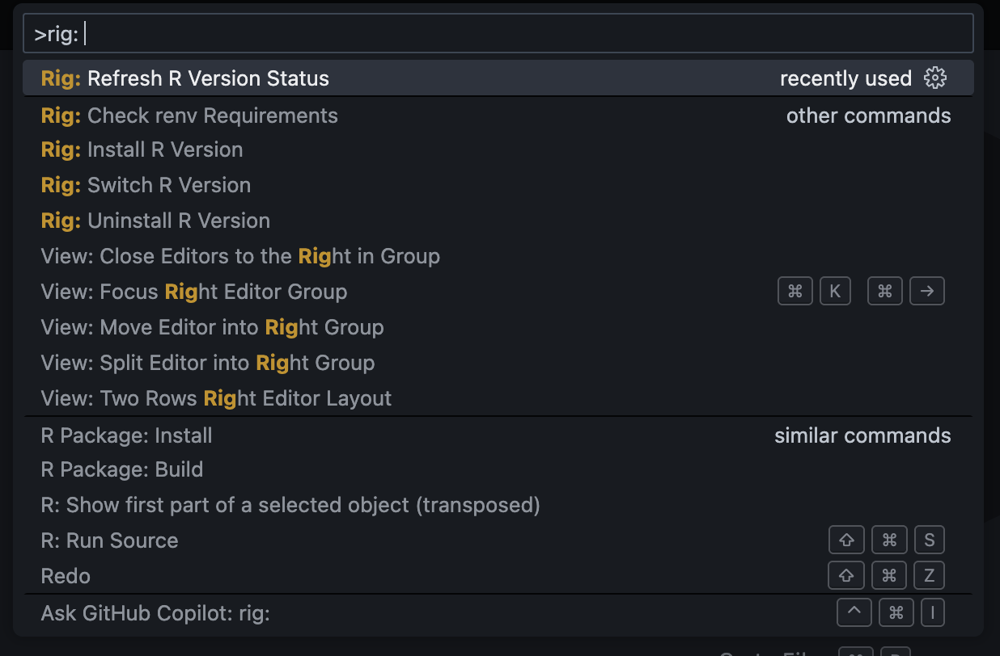

# Rig Manager for Visual Studio Code

A powerful VS Code extension for seamlessly managing your R versions with the [rig](https://github.com/r-lib/rig) R installation manager. Switch between R versions, manage installations, and maintain project-specific environments directly from within VS Code.

## 🚀 Features

### 📊 **Persistent Status Bar Integration**

See your current default R version at a glance in the Status Bar. Click to quickly switch between installed versions.



### ⚡ **One-Click Version Switching**

Effortlessly switch between your installed R versions with an intuitive quick-pick interface.



### 🖥️ **Smart R Console Management**

- **Auto-launch**: R console automatically starts with your default rig version
- **Smart restart**: Console restarts with the correct version when you switch
- **REditorSupport integration**: Works seamlessly with the R extension



### 📦 **renv Project Integration**

- **Automatic detection**: Scans for `renv.lock` files in your workspace
- **Version suggestions**: Prompts to switch to project-required R versions
- **Missing version handling**: Offers to install required versions automatically (macOS only)
- **Project consistency**: Ensures your R environment matches project requirements



### 🎯 **Complete Version Management**

- **Install new versions**: Browse and install available R versions (macOS only)
- **Safe uninstallation**: Remove unused R versions (with protection for default version) (macOS only)
- **Version validation**: Ensures you don't accidentally remove critical installations
- **Progress tracking**: Visual progress indicators for all operations

### 🎨 **Command Palette Integration**

Access all functionality through VS Code's Command Palette (`Ctrl+Shift+P` / `Cmd+Shift+P`):

- `Rig: Switch R Version` - Quick switch between installed versions
- `Rig: Install R Version` - Browse and install new R versions (macOS only)
- `Rig: Uninstall R Version` - Remove unused R installations (macOS only)
- `Rig: Refresh R Version Status` - Update status bar and restart console
- `Rig: Check renv Requirements` - Manually check project requirements



## 📋 Requirements

### Essential Dependencies

- **[rig](https://github.com/r-lib/rig)**: Must be installed and available in your system's `PATH`
- **R installations**: At least one R version managed by rig

### Installation Instructions

Visit the [official rig repository](https://github.com/r-lib/rig) for platform-specific installation instructions:

```bash
# macOS (via Homebrew)
brew tap r-lib/rig
brew install --cask rig

# Windows (via Chocolatey)
choco install rig

# Linux (via download)
curl -Ls https://github.com/r-lib/rig/releases/download/latest/rig-linux-$(arch)-latest.tar.gz | `which sudo` tar xz -C /usr/local
```

### Recommended Extensions

- **[R Extension for Visual Studio Code](https://marketplace.visualstudio.com/items?itemName=REditorSupport.r)**: Enhanced R language support

## ⚙️ Configuration

This extension contributes the following settings:

| Setting                           | Type      | Default | Description                                                          |
| --------------------------------- | --------- | ------- | -------------------------------------------------------------------- |
| `rig-manager.statusBar.visible`   | `boolean` | `true`  | Show/hide the R version status bar item                              |
| `rig-manager.rConsole.autoLaunch` | `boolean` | `true`  | Automatically launch R console on extension activation               |
| `rig-manager.renv.autoCheck`      | `boolean` | `true`  | Automatically check for renv.lock files and suggest version switches |

### Accessing Settings

1. Open VS Code Settings (`Ctrl+,` / `Cmd+,`)
2. Search for "rig-manager"
3. Adjust settings as needed

## 🔄 Activation

The extension automatically activates when:

- Opening R files (`.R`, `.r`)
- Opening R Markdown files (`.Rmd`, `.rmd`)
- Workspace contains R files
- Workspace contains `.Rprofile`
- Workspace contains `renv.lock`

## 🛠️ Usage

### Basic Workflow

1. **Install rig** and set up your R versions
2. **Open an R project** in VS Code
3. **Check the status bar** for your current R version
4. **Switch versions** by clicking the status bar or using commands
5. **Work with confidence** knowing your environment matches your project

### Version Management

- **Switching**: Click status bar item or use `Rig: Switch R Version`
- **Installing**: Use `Rig: Install R Version` to browse available releases
- **Removing**: Use `Rig: Uninstall R Version` (protects default version)

### Project Integration

- **renv projects**: Extension automatically detects version requirements
- **Version mismatches**: Get prompted to switch to project-required versions
- **Missing versions**: Option to install required versions automatically

## Common Issues

- This is an early version of the extension. Please report any bugs or feature requests on the [GitHub repository issues page](https://github.com/WahiduzzamanKhan/rig-manager-vscode/issues).

## 📄 License

This project is licensed under the MIT License - see the [LICENSE](LICENSE) file for details.

## 🙏 Acknowledgments

- **[rig team](https://github.com/r-lib/rig)**: For creating the excellent R installation manager
- **[REditorSupport](https://github.com/REditorSupport)**: For the foundational R extension for VS Code

---

## 📒 Changelog for this version

### Added

- Launch R Terminal via REditorSupport if installed.
- Command to install R version (macOS only).
- Command to uninstall R version (macOS only).
- `renv` integration: Automatic detection of `renv.lock` files in workspace.
- Smart version switching suggestions based on project requirements.
- Command to manually check renv requirements.
- Configuration options for extension behavior.
  - `rig-manager.statusBar.visible`: Show/hide status bar item
  - `rig-manager.rConsole.autoLaunch`: Auto-launch R console
  - `rig-manager.renv.autoCheck`: Auto-check renv requirements
- MIT License

### Fixed

- Properly dispose of existing R terminals when switching versions.
- Prevent multiple R consoles from being created when switching versions.
