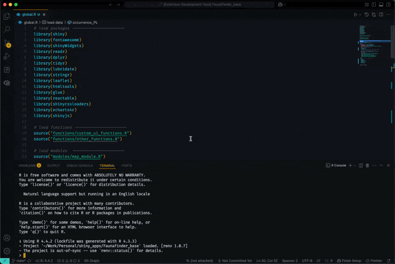

# Rig Manager for Visual Studio Code

An extension to seamlessly manage your R versions with the [rig](https://github.com/r-lib/rig) R installation manager, directly from within VS Code.

This extension activates automatically in R projects, providing an integrated experience for switching R versions and working with the corresponding R console.

## Features

### Persistent Status Bar Item
See the current default R version at a glance in the Status Bar as soon as you open an R project.

### Quick Version Switching
Click the Status Bar item to quickly switch between your installed R versions.

### Automatic R Console
An R console corresponding to your default `rig` version is automatically launched when the extension activates. The R console is also automatically restarted with the correct version when you switch, ensuring your environment is always in sync.

### Command Palette Integration
Access all features through the Command Palette:
  * `Rig: Switch R Version`
  * `Rig: Refresh R Version Status`

---

## Requirements

You must have `rig` installed and available in your system's `PATH`. You can find installation instructions on the [official rig repository](https://github.com/r-lib/rig).

## Extension Settings

This extension does not currently contribute any settings to VS Code.

## Known Issues

* This is an early version of the extension. Please report any bugs or feature requests on the [GitHub repository issues page](https://github.com/WahiduzzamanKhan/rig-manager-vscode/issues).

## Release Notes

### 0.1.0

- Quickly switch R version.
- Show up in status bar.
- Auto activate based on the opened folder/file.
- Auto launch R console.
